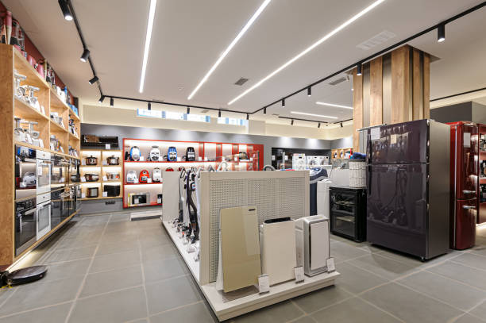

# Superstore Sales Analysis

## Introduction
Superstore, a fictional retail company which has been in operation for 4 years is looking to improve their sales and overall performance. The store's data experts have been tasked with analyzing the company's data which has been generated over the years of operation to present actionable insights to the stakeholders.

I, the junior data analyst was tasked by the data team to present to them a general report of the company's performance and recommendations that will be of importance to the stakeholders or that can be further investigated before the presentation to the stakeholders.

_This report is a documentation of the highlight of my analysis and presentation to be delivered to the data team._

## Business Task
The team is interested in an analysis of the store's historical data so they can better understand how the store and their products have performed over the years and what operations they need to improve. They also expect insightful recommendations from the data analyst. All of this will serve as an introduction to the presentation to the stakeholders.

## Data Sourcing 
The dataset this personal project was carried out on is a CSV file which was gotten from Kaggle and can be accessed here: [Superstore dataset ](https://www.kaggle.com/blurredmachine/superstore-time-series-dataset)

## Skills Demonstrated
1. Exploratory Data Analysis 
2. Data Transformation
3. Basic Statistics
4. Data Validation
5. Intermediate Data Analysis

## Analysis Process
The documentation of the analysis process can be found here
1. [Data importation and Validation](https://github.com/NelsonAbolaji/Superstore-Sales-Analysis/blob/main/data_importation_and_validation.md)
2. [Answers to Business Questions](https://github.com/NelsonAbolaji/Superstore-Sales-Analysis/blob/main/Superstore_order_queries.md)

## Observations
1) 60 percent of our orders were sent for delivery later than the stipulated date.
2) We received the most orders and made the most sales from the West and the least orders and sales from the South of the United States.
3) We recorded losses from 10 states after our losses were deducted from profits.
4) There are orders we recorded a loss from the sale instead of a profit. 
5) We have lost 36 percent of our profit to sales loss deduction since we began operation. Each year, we lose 35.63 percent of the company's sales profit to losses incurred from sales.
6) Consumers make the most orders and generate the most sales for the store.
7) There is a 35.49% difference between the profit percentages of the Furniture and Office Supplies category even though their sales percent is only different by 0.92%
8) Phones are our most profitable sub category.
9) Sales growth dropped after the first year of operation but rose sharply in the third year and dropped by a percentage in the fourth year while profit improved by a percent each year.
10) We make the most sales in the months of November and December and the least sales at the beginning of the year; February and January.
11) Wednesday is the only day we record markedly low sales.
12) We make the most sales in the 4th quarter of the year.

## Recommendations
1) The logistics department should look into the reason why 60 percent of the orders made were sent late for shipping and proffer a solution which will aim to reduce the average time before shipping from 4 days to 2 days.
2) The data team and other involved departments should look into the reason for the low orders that come from the Southern and Central region states e.g. pre-existing competitor with more pocket friendly offers. 
3) Data should be collected on the reason for the loss of 35.63 percent of sales profit each year and the case should be investigated by the data and logistics department. These should also spotlight the cause of losses incurred from individual orders. Their intervention will help to increase our final profits after loss deduction. 
4) The marketing team should work on driving sales by attracting new customers through advertisements and other creative means, and the rolled out initiatives should place an extra focus on Consumers and consumer friendly products. They should also work on improving sales on days, months and quarters where sales are low. These time periods have been listed in the 'Observation' section.
